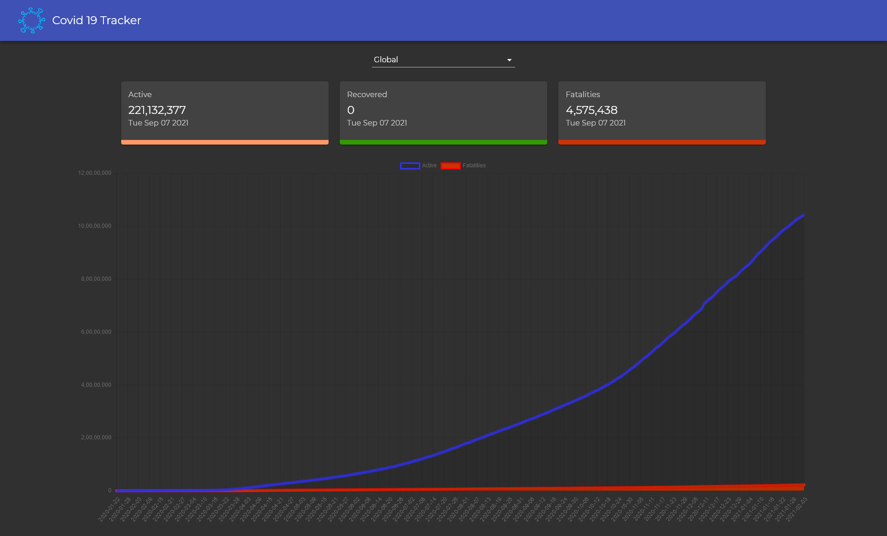

## Covid-19 Tracker 
#### [Live Demo](https://supratikr.github.io/covid-tracker/)

**A simple web application which allows you to visualize covid-19 data. Api used to fetch the data - https://covid19.mathdro.id/api**

#### :wrench: Technologies and Tools

#### :spiral_notepad: Current Version and Future plans
The application works fully on web and on mobile devices. Only issue is with the 3rd party api which has stopped giving the recovered case numbers hence the **Recovered** section always shows 0.